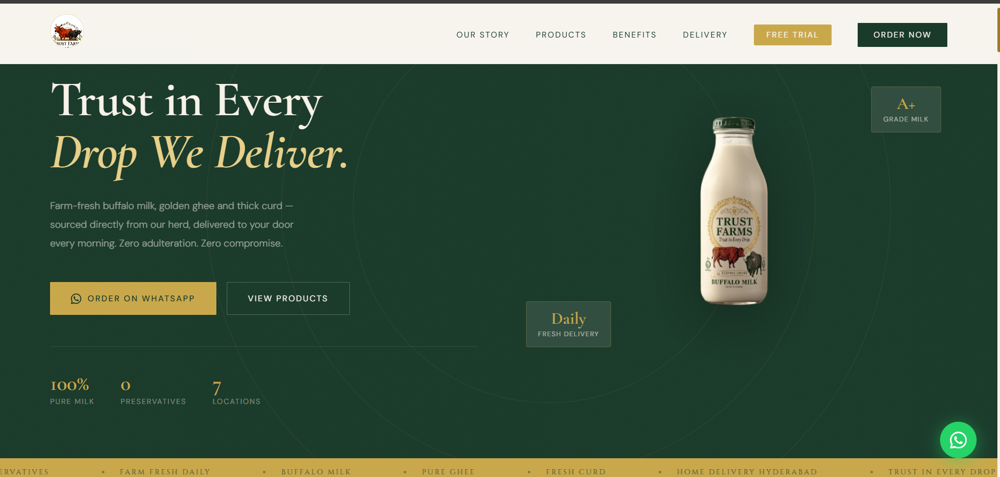
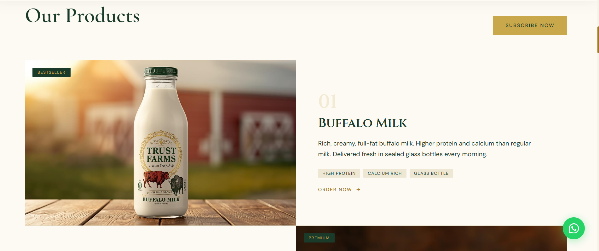
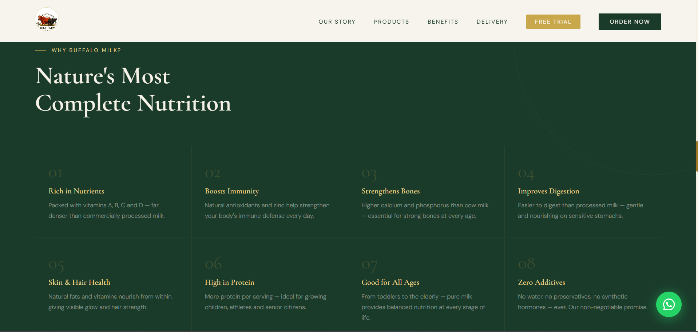
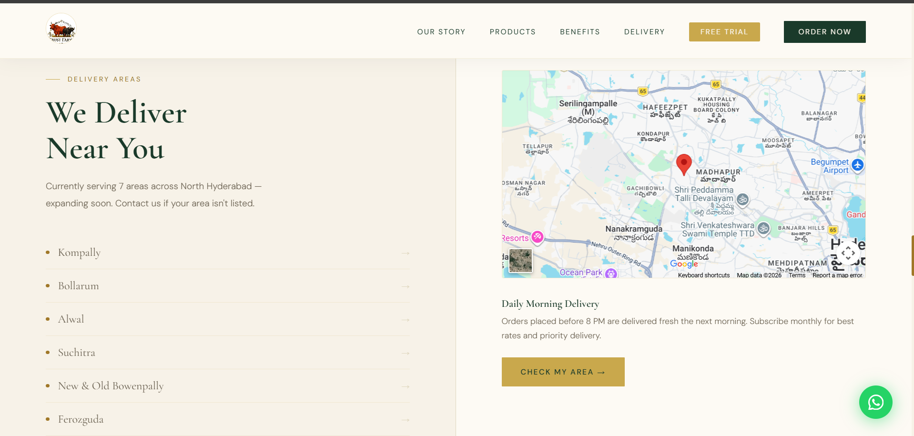

# 🌿 Trust Farms – Fresh Dairy Farm Website

> **A modern and responsive business website developed for Trust Farms to showcase fresh dairy products and establish a strong online presence.**

---

# 📖 Overview

Trust Farms is a responsive business website developed for a real farm business to promote its fresh dairy products and services. The website provides customers with detailed information about the farm, its products, and their benefits through a clean, user-friendly, and visually appealing interface.

The project was designed with a strong focus on responsive design, modern UI/UX principles, and accessibility to ensure a seamless browsing experience across desktops, tablets, and mobile devices.

---

# 🎯 Project Objective

The primary objective of this project was to:

- Build a professional online presence for Trust Farms.
- Showcase fresh dairy products in an engaging way.
- Improve customer engagement through a modern interface.
- Provide easy access to business information.
- Deliver a responsive experience across all screen sizes.

---

# 🚀 Features

- Responsive Landing Page
- Modern Navigation Bar
- Hero Section
- Product Showcase
- Product Benefits Section
- About Trust Farms
- Delivery Information
- Order Now Call-to-Action
- Smooth Scrolling
- Interactive User Interface
- Mobile-Friendly Design
- Clean & Professional Layout

---

# 🛠 Technologies Used

- HTML5
- CSS3
- JavaScript
- Git
- GitHub

---

# 💡 Challenges Faced

### Responsive Design

Designed the website to work seamlessly across desktops, tablets, and mobile devices using responsive layouts and media queries.

### User Experience

Created an intuitive navigation system and well-structured content layout to provide visitors with a smooth browsing experience.

### Visual Design

Designed a modern interface using natural color palettes, attractive typography, and product imagery that reflects the identity of Trust Farms.

### Performance Optimization

Optimized layouts and styling to ensure smooth rendering and better performance across different devices.

---

# ✅ Problems Solved

This project helps Trust Farms by:

- Establishing a professional online presence.
- Showcasing dairy products effectively.
- Making business information easily accessible.
- Improving customer engagement.
- Providing a responsive and user-friendly browsing experience.

---

# 📷 Project Screenshots

## 🏠 Home Page

Modern landing page introducing Trust Farms and its premium dairy products.



---

## 🥛 Products Section

Showcases Trust Farms' premium dairy products with detailed descriptions and a clean, modern product display.



---

## 🌱 Benefits Section

Highlights the nutritional benefits of fresh buffalo milk, emphasizing health, purity, and quality.



---

## 🚚 Delivery Section

Displays the delivery coverage areas, location map, and fresh daily delivery information for customers.


---

# 🌐 Live Demo

https://snazzy-taiyaki-a1095e.netlify.app

---

# 📂 Project Structure

```
Trust-Farms/
│
├── index.html
├── style.css
├── script.js
├── README.md
│
└── Images/
    ├── farm1.jpg
    ├── farm2.jpg
    ├── farm3.png
    ├── farm4.jpg
    ├── milk.jpg
    ├── milk-nobg.png
    └── ghee.jpg
```

---

# 🌱 Future Improvements

- Contact Form
- Product Inquiry Form
- Customer Testimonials
- SEO Optimization
- Accessibility Improvements
- Performance Enhancements

---

# 📈 What I Learned

Through this project, I improved my understanding of:

- Semantic HTML5
- Responsive Web Design
- CSS Flexbox & Grid
- JavaScript DOM Manipulation
- UI/UX Design Principles
- Building Professional Business Websites
- Cross-Browser Compatibility
- Git & GitHub Workflow
- Client Requirement Analysis

---

# 🌐 Live Website

🔗 **https://snazzy-taiyaki-a1095e.netlify.app**

---

⭐ If you found this project interesting, feel free to star the repository!
---

# 👨‍💻 Author

**Your Name**

- GitHub: https://github.com/kabhimitrain
- LinkedIn: https://www.linkedin.com/in/katipally-abhimitra-reddy-8bab142b9/

---

# 📄 License

This project is created for educational and portfolio purposes.

---

⭐ If you found this project interesting, feel free to star the repository!
